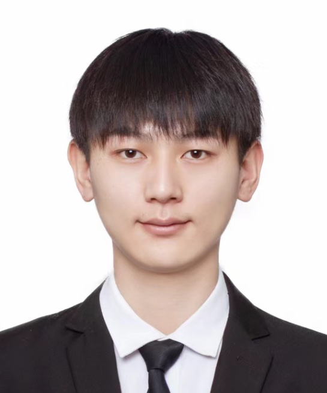

    

        
        姜钧窦
         
        &#x1F3D8; 上海 | 
        &#x1F4DE; 13368730923 | 25岁 | 男 
         
        &#x1F4E7; <a href="mailto:u201613094@alumni.hust.edu.cn", style="font-family:Open Sans;font-size:13px;">u201613094@alumni.hust.edu.cn</a>
         <a href="https://github.com/HUSTJJD", style="font-family:Open Sans;font-size:13px;">HUSTJJD</a>
        &#x1F5A5; <a href="https://hustjjd.github.io/", style="font-family:Open Sans;font-size:13px;">Blog</a>
    

###  **Skill** 

- Programming:  **C/C++ | Lua | Python**  INTEREST( Rust | TS )
- Unreal Engine:  UMG | Gameplay | Unlua
- Tools:  Rider | VisualStudio | VisualStudioCode | AndroidStudio | XCode | GDB | PerfDog | UnrealInsights | RenderDoc | Houdini | CMake | Git | MarkDown
- Graphics:  Fluid Simulation | Animation | Rendering
- Machine Learning:  Computer Vision | Generative Model | Reinforcement Learning

###  **Experience** 

 元梦之星 
 游戏客户端 T7 
 腾讯天美 T1 Studio 
 2023.03 - 

- 负责UGC地图数据系统，包括序列化、保存加载、压缩及存储、加密、上传下载、发布审核、引擎工具等
- 负责云端文件管理、多端ASTC贴图的工具链开发
- 负责UGC模块的功能开发，主导新手引导、拍照系统、UI元件、AIGC、预设、相册访问等，参与高级设置、编程、NPC、Gameplay、UGC分大厅等，预研四足生物、多阵营、多关卡、大乱斗玩法等
- 负责效能工具开发，包括Crash自动分配工具、地图数据解析工具、CI/CD等
- 参与UGC模块的内存泄漏、性能、安全、断线重连等专项问题处理
- 参与一致性物理引擎-数学物理模块开发，参与开源组件trpc-cos开发
- 荣誉：**2024 H1 OutStanding**

 爆笑向前冲 | 超级QQ秀-王者周年庆 
 实习 
 腾讯天美 T1 Studio 
 2022.05 - 2022.08 

- 负责强化学习AI的SDK接入与训练框架搭建
- 负责游戏状态设计与算法模型调优，验证强化学习AI在该品类中的可行性
- 负责关卡Gameplay开发，为TD提供技术支持

 龙驰通用网格生成软件 
 C++开发 
 工程数值模拟国重点实验室 
 2020.10 - 2023.05 

- 项目初始成员，负责结构网格/非结构网格的生成、质量检测算法开发
- 参与基于QT/Python重构开发Tcl/TK界面及Perl/Scheme脚本，解析和封装Fortran/C/C++数据算法层，重构RPC框架
- 参与网格软件架构、CAD几何内核的研究
- 负责HPC集群Slurm、Docker的搭建和使用培训
- 成果：龙驰通用网格生成软件获“2024优秀自主工业仿真软件”荣誉称号

###  **Education** 

 计算机技术 
 硕士 
 四川大学 
 2020.09 - 2023.06 

- GPA: 3.4 / 4.0. 就读于 工程数值模拟基础算法与模型全国重点实验室 导师：邓小刚 院士
- 荣誉/奖项：参与XXXX-X国家重大工程项目、优秀研究生干部、二等奖学金
- 研究经历：深度神经网络在计算流体力学与网格划分中的应用，商用CAE工业软件的设计与开发

 生物药学 
 本科 
 华中科技大学 
 2016.08 - 2020.06 

- 荣誉/奖项：学生会主席（2019）、优秀毕业生代表、校学生代表、优秀学生干部、优秀共青团员、文体奖学金（2019）、公益奖学金（2017-2018）
- 研究经历：复杂食品样品中的雌激素含量分析研究，基于分子对接的獐牙菜属植物药用价值研究

###  **Publications** 

- Jundou Jiang,Guanxiong Li,Yi Jiang,Laiping Zhang,Xiaogang Deng,TransCFD: A transformer-based decoder for flow field prediction,EAAI,Volume 123,Part B,2023,106340,ISSN 0952-1976,https://doi.org/10.1016/j.engappai.2023.106340. **JCR Q1, IF 7.5, CI 18.**
- 姜钧窦,姜屹,陈亮中,等.基于Transformer解码器网络的翼型流场预测方法. CN202211469160.1 [2024-11-22]. 主要完成人,已授权.
- 姜钧窦,朱一秦,杨越.虚拟关卡的颜色变更方法、装置、设备及存储介质. 202311083008.4. 主要完成人,审查中.
- 杨越,姜钧窦,刘思博.图像生成方法、装置、设备及存储介质. 202311109510.8. 主要完成人,审查中.

###  **Misc** 

- 技能： Ansys ICEM、Fluent、PointWise等流体仿真软件，Adobe音视频软件，Office
- 证书/执照： 计算机四级（网络）、英语（CET-6）、教师资格证（高中物理）
- 兴趣： 骑行、摄影、篮球
- 自评： 做事踏实认真负责，执行能力强，有owner意识，具备快速学习能力
